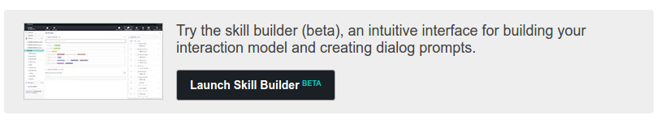

# AlexaTutorial

In order to build an Alexa-enabled streaming application, the developer will
need to create an Alexa custom skill and an android application. 

The custom skill is a standard Alexa skill with the addition of a couple of intents specific to controlling the streaming app. In order to enable the control of the streaming app the custom skill is directed to use the Netzyn service endpoint running on AWS lambda servers.

The android application in not limited in its functionality, and is only required to instantiate the interface to the streaming apps API and to implement the responses to the Alexa voice command intents. The sample code in this tutorial will create a separate class that isolates the interaction with the streaming app API and a java interface for the required commands.

The implementation described herein is a simple "Hello World" application that allows you to say a greeting to Alexa and have the android application provide a response. 

## Alexa Custom Skill
Before creating the custom skill for this tutorial it is recommend that the developer take some time to get familiar with some of the aspects of Alexa skills development, using the following links. Note, that the service endpoint is supplied by the streaming apps platform, so that part of the documentation can be safely ignored.

* [Getting started with Alexa Skills Kit](https://developer.amazon.com/public/solutions/alexa/alexa-skills-kit/getting-started-guide)
* [Understanding Custom Skills](https://developer.amazon.com/public/solutions/alexa/alexa-skills-kit/overviews/understanding-custom-skills)
* [Step-by-Step guide to Trivial Skill](https://github.com/alexa/skill-sample-nodejs-trivia)

The last of these (the step-by-step guide) provides steps for creating a skill along with the service endpoint on AWS lambda. For our purposes only Step 1 is required. Also, we recommend that you utilize the Alexa Skills kit builder rather than the original developer portal for defining interaction. 

So, when you get to item 5. you should select **Launch Skill Builder**

This will take you to the Alexa Skills Kit Skills Builder, a more interactive and directed tool for defining Alexa interactions. On the left side you can see the options for dashboard (the initial view), code editor, intents and slots. For this tutorial we will use the provided json file, [helloworld.json](./helloworld.json).

(Note: the interactions option will take you directly to the Skills Builder, from now on).

Copy the text from this file and then select the code editor option from the sidebar. 

Use Control-A to select all the text in the code editor, then paste the json copied from the helloworld.json file. Click the Apply Changes button.

 
 
 

