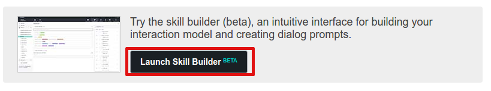
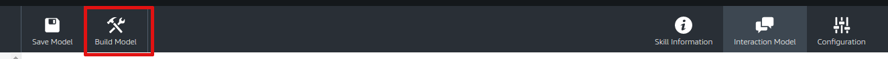
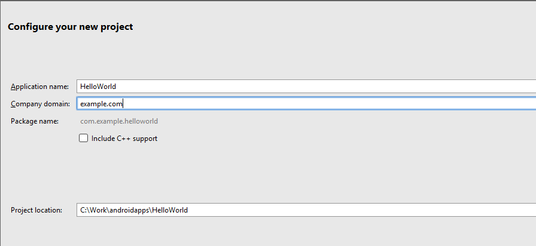

# Streaming Apps with Alexa Interaction

In order to build an Alexa-enabled streaming application, the developer will
need to create an Alexa custom skill and an android application. 

The custom skill is a standard Alexa skill with the addition of a couple of intents specific to controlling the streaming app. In order to enable the control of the streaming app the custom skill is directed to use the Streaming Apps service endpoint running on AWS lambda servers.

The android application in not limited in its functionality, and is only required to instantiate the interface to the streaming apps API and to implement the responses to the Alexa voice command intents. The sample code in this tutorial will create a separate class that isolates the interaction with the streaming app API and a java interface for the required commands. 
The implementation described herein is a simple "Hello World" application that allows you to say a greeting to Alexa and have the android application provide a response. 

## Alexa Custom Skill
Before creating the custom skill for this tutorial it is recommend that the developer take some time to get familiar with some of the aspects of Alexa skills development, using the following links. Note, that the service endpoint is supplied by the streaming apps platform, so that part of the documentation can be safely ignored.

* [Getting started with Alexa Skills Kit](https://developer.amazon.com/public/solutions/alexa/alexa-skills-kit/getting-started-guide)
* [Understanding Custom Skills](https://developer.amazon.com/public/solutions/alexa/alexa-skills-kit/overviews/understanding-custom-skills)
* [Step-by-Step guide to Trivial Skill](https://github.com/alexa/skill-sample-nodejs-trivia)

The last of these (the step-by-step guide) provides steps for creating a skill along with the service endpoint on AWS lambda. For the initial setup, follow Step 1 up to item 5. An application ID is defined for the skill, this ID will need to be copied to the application configuration. 

This tutorial uses the Alexa Skills kit builder rather than the original developer portal for defining interaction. 

So, when you get to item 5. you should select **Launch Skill Builder**



### Skills Builder
This will take you to the Alexa Skills Kit Skills Builder, a more interactive and directed tool for defining Alexa interactions. On the left side you can see the options for dashboard (the initial view), code editor, intents and slots. For this tutorial we will use the provided json file, [helloworld.json](./helloworld.json). (Note: the interactions option will take you directly to the Skills Builder, from now on).

Copy the text from this file and then select the code editor option from the sidebar. 


Use Control-A to select all the text in the code editor, then paste the json copied from the helloworld.json file. 

Click the Apply Changes button.


 
Click the Dashboard button to return to the dashboard.

 

There are now three custom intents defined, Close, hello, Move. Two of these, Close and Move are for controlling the streaming app, the last hello will be deliver to the streaming app via the streaming apps API. The final step on this page is to build the model, do this by clicking on the BuildModel button. The build will commence and with a model this small should not take too long to complete. 



Now that the model is built move to the configuration screen by clicking on the Configuration option in the icon menu.


### Configuring Service Endpoint

The configuration screen is where the service endpoint is assigned. The streaming apps platform provides the service endpoint running on AWS lambda
* Select AWS Lambda as the service endpoint type
* Select North America as the geographical region
* Enter the ARN provided from the application configuration

 

### Configuring Account Linking

Streaming apps require account linking in order to associate the users device with the Alexa interaction. 
* Select yes for account linking which will enable the remaining field in the screen. 
* Enter the authorization URL, provided with your application configuration. 
* Select implicit grant as the authorization grant type. 

The two Redirect URLs will need to be copied to your application configuration as these are used to validate the authorization requests coming from Alexa during account linking.


Select Save or Next at the bottom of the screen to save the configuration. 

The Alexa app is ready to go, and should show up in the Alexa app under Your Skills.

## Android Application

For the android application we will be using android studio vers. 2.3.1 and SDK version 25. There are two choices for developing the application, download the application from github or create the application in Android Studio and add the files from this repository

### Download/clone application

Go to this repository and clone or download the project [repository](https://github.com/Netzyn/HelloWorldApp)

Edit `VoiceInterface.java`, replacing `CHANGE_TO_APP_NAME` on line 11 to the app name assigned to your application.

### Create the Android Application

Open android Studio and select New project either from the android studio welcome screen or from the File menu within android studio.


The following screen will be presented, fill in the fields with the appropriate values, the ones show are just samples.



Select next to accept the inputs and go to the next screen, select next, on the subsequent two screens to accept the default inputs and select finish on the last screen to create the application.

### Add Files

Add the two files, `HelloWorldClientInterface.java` and `VoiceInterface.java`, to the project in the package `com.netzyn.example`. 

Also, place the two libraries, `nzlib.jar` and `protobuf-java-2.5.0.jar` in the folder `app/libs`

### Edit the files

Edit `VoiceInterface.java`, replacing `CHANGE_TO_APP_NAME` on line 11 to the app name assigned to your application.


Modify the Main activity (MainActivity.java) as follows:

* Modify `MainActivity` class so that it implements the interface `HelloWorldClientInterface`.

```java
public class MainActivity extends AppCompatActivity implements HelloWorldClientInterface {
  . . .
}
```

* Add an instance variable `api` that will hold the created `VoiceInterface` object:

```java
  private VoiceInterface api;
```

* In the `onCreate` function create the VoiceInterface object, passing a reference to the activity (as a `HelloWorldClientInterface` implementation) and a reference to the `Intent`. (Note: this is an android Intent, which is completely separate from Alexa voice intents)

```java
  api = new VoiceInterface(this, this.getIntent());
```

* Implement the function defined in the `HelloWorldClientInterface` interface: `void HelloWorld();`. A sample implementation that shows a toaster message in the app is provided here. (The example shows how voice interface commands need to be posted to the UI thread in most cases);

```java
  void ShowToast(String msg) {
    Toast toast = Toast.makeText(
          this.getApplicationConext(),
          msg,
          Toast.LENGTH_LONG);
    toast.show();
    )
  }

  void HelloWorld() {
    this.runOnUiThread(new Runnable() {
      @Override
      public void run() {
        ShowToast("Hello received");
      }
    });
  }
```

### Build apk file

Use the build tool to build the application:


If there are no errors, then build the apk file by selecting Build Apk from the Build menu.

The apk file will be located in `app/build/outputs/apk/app-debug.apk`.

Follow the instructions on the developer page for uploading the apk file.


 

